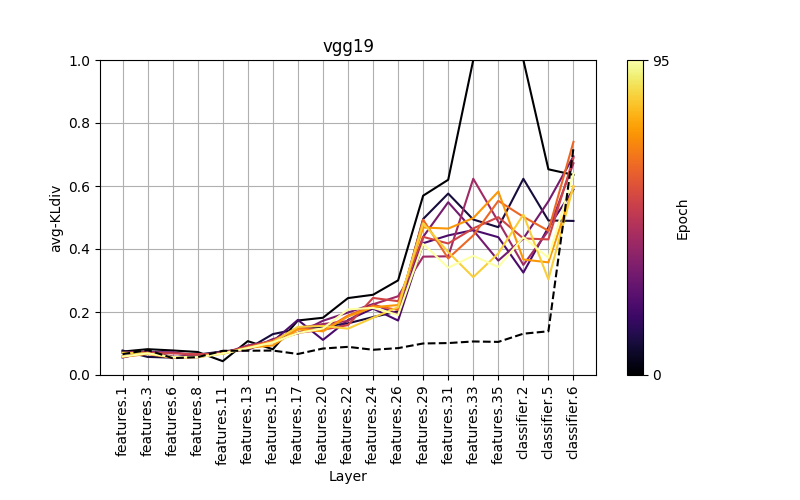

### Representational Analysis in ANNs

Experimenting with some ideas for the analysis and comparison of the learned representations in deep networks by using information theory and spectral analysis.

The aim is to come up with a way to measure how abstract or complex a representation is and understand how it evolves on different levels and on different networks that overfits or underfits. 

